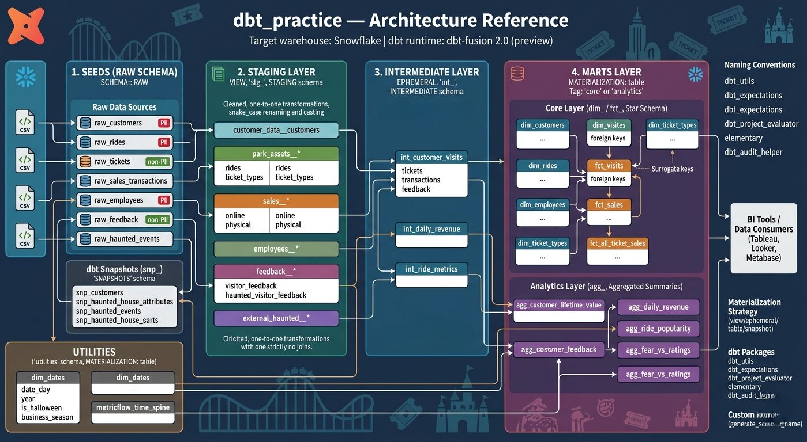

# Horrorland Theme Park Analytics : dbt Project

A **dbt** project for theme park ticket sales, visitor satisfaction, ride performance, and seasonal haunted attractions analytics, built on **Snowflake**. The business scenario appears to be a theme park with a haunted attractions program. That is an inference from the model and column names in this repo, not an explicitly stated business brief.

This project serves two purposes:

1. **Production-style analytics** : a working dimensional model for visits, ticket revenue, in-park sales, customer segmentation, ride quality, and haunted house analysis
2. **Learning lab** : a set of Snowflake and dbt pattern demos under `models/macro_demos/`, with working examples for incrementals, hooks, governance, custom materializations, schema drift, and testing

---

## Quick Start

```bash
dbt deps
dbt seed
dbt build

```

---

## Project Structure

```text
dbt_morning/
├── analyses/                        # Analysis queries, including audit helper comparisons
├── macros/                          # Custom macros, generic tests, Snowflake materializations
├── models/
│   ├── staging/                     # Source-aligned staging models by domain
│   ├── intermediate/                # Reusable business logic models
│   ├── marts/
│   │   ├── core/                    # Dimensions and fact tables
│   │   └── analytics/               # Business-facing aggregate marts
│   ├── utilities/                   # Calendar and semantic layer utility models
│   ├── macro_demos/                 # dbt and Snowflake pattern demos
│   ├── sources.yml                  # Source definitions
│   ├── exposures.yml                # Dashboard exposures
│   ├── semantic.yml                 # Semantic layer note
│   └── semantic_layer.yml           # Semantic layer design notes
├── seeds/                           # Synthetic raw datasets and macro demo sample datasets
├── snapshots/                       # SCD Type 2 snapshots
├── tests/                           # Singular tests
├── docs/                            # BRD, functional specification, technical design doc
├── dbt_project.yml
├── packages.yml
├── requirements.txt
└── Project_diagram.png
```

| Layer | Actual contents | Notes |
|---|---:|---|
| Seeds | 12 CSV files | 7 raw datasets and 5 macro demo sample datasets |
| Staging | 10 models | Customer, sales, park assets, feedback, external haunted |
| Intermediate | 3 models | Revenue, ride metrics, customer visits |
| Core marts | 9 models | Dimensions and facts |
| Analytics marts | 10 models | Revenue, CLV, ride, haunted, and seasonal analysis |
| Utilities | 2 models | `dim_dates`, `metricflow_time_spine` |
| Snapshots | 7 snapshots | Customer, employee, ride, pricing, ticket, haunted, feedback history |
| Singular tests | 1 SQL test | Negative ticket price check |
| Analysis queries | 1 SQL file | `audit_stg_tickets.sql` |
| Macro demos | 26 SQL demo models | Incrementals, hooks, governance, materializations, vars, schema drift |

---

## Core Data Model

### Dimensions

| Model | Grain | Purpose |
|---|---|---|
| `dim_customers` | 1 row per customer | Customer segmentation, lifecycle, VIP, loyalty, retention, upsell fields |
| `dim_rides` | 1 row per ride | Ride attributes plus aggregated review metrics |
| `dim_employees` | 1 row per employee | Employee hierarchy, department, tenure, salary estimate |
| `dim_ticket_types` | 1 row per ticket type | Ticket type reference attributes derived from raw tickets |
| `dim_transaction_flags` | 1 row per unique flag combination | Junk dimension for low-cardinality ticket sale flags |
| `dim_dates` | 1 row per calendar day | Calendar logic, weekend flags, Halloween season support |

### Facts

| Model | Grain | Purpose |
|---|---|---|
| `fct_all_ticket_sales` | 1 row per sale | Unified ticket sales across online and physical channels |
| `fct_haunted_house_tickets` | 1 row per haunted ticket assignment | Haunted ticket analysis joined to haunted house attributes |
| `fct_sales` | 1 row per POS transaction line | In-park sales facts |
| `fct_visits` | 1 row per visit ticket | Visit-level revenue and satisfaction |
| `fct_sales_with_junk_key` | 1 row per sale | Ticket sales fact variant using `dim_transaction_flags` |

### Analytics Models

| Model | Business question |
|---|---|
| `agg_daily_revenue` | What is daily ticket revenue, in-park revenue, and revenue per visitor? |
| `agg_customer_lifetime_value` | Which customer segments generate the most lifetime ticket revenue? |
| `agg_ride_popularity` | Which rides are most popular and best rated? |
| `agg_fear_vs_ratings` | Does haunted house fear level correlate with satisfaction? |
| `agg_halloween_spending` | How does ticket spending change around Halloween? |
| `agg_happiest_houses` | Which haunted houses have the happiest visitors? |
| `agg_house_profitability_by_time` | How do haunted house outcomes vary by time slot? |
| `agg_ticket_value` | Which haunted ticket tiers deliver the best value? |
| `agg_vip_satisfaction` | Are VIP haunted visitors more satisfied than non-VIP visitors? |
| `agg_visitor_recommendations` | Which visitor types are most likely to recommend? |

---

## Data Domains Covered

This repo actually models these domains:

- Customer accounts and membership attributes
- Ticket sales across online and physical channels
- In-park point of sale transactions
- Ride and attraction reference data
- Employee roster attributes
- Visitor feedback and ratings
- Haunted house and seasonal event analysis
- Date spine and seasonal calendar logic
- Snapshot history for changing business entities

Out of scope in the current repo:

- Hotel, parking, or reservation systems
- Loyalty redemptions or CRM campaign response data
- Real payment processor detail
- Fully reliable haunted house assignment in source data. Haunted ticket assignment is inferred in staging
- Airflow orchestration. There is no Airflow project or `.github/workflows` folder in this repo

---

## Snapshots

The project includes 7 SCD Type 2 snapshots:

| Snapshot | Tracks changes to |
|---|---|
| `snp_customers` | Customer profile fields such as contact details, VIP status, and loyalty points |
| `snp_employees` | Employee attributes over time |
| `snp_rides` | Ride attributes over time |
| `snp_ticket_sales_history` | Ticket sale changes such as price, discount, and payment method |
| `snp_product_pricing_history` | Ticket product pricing and attributes |
| `snp_haunted_house_attributes` | Haunted house capacity and fear level changes |
| `snp_visitor_feedback_changes` | Satisfaction and recommendation changes on feedback records |

---

## Macro  and Technical Patterns


The macro library also includes reusable business and platform macros such as:

- `spending_tier`
- `visit_time_of_day`
- `incremental_filter`
- `mask_pii`
- `cross_db_surrogate_key`
- `generate_date_spine`
- `apply_cluster_by`
- `attach_row_access_policy`
- `feature_flag`
- `apply_query_tag`

---

## Testing and Data Quality

This repo uses several kinds of tests.

- YAML `data_tests:` across staging, marts, snapshots, and seeds
- Custom generic tests in `macros/11_generic_tests/`
- Package-based tests from `dbt_expectations`
- Singular SQL test: `tests/assert_final_price_non_negative.sql`
- Unit tests in selected schema YAML files, especially `models/intermediate/schema.yml`
- Analysis comparison query: `analyses/audit_stg_tickets.sql` using `dbt-audit-helper`

Examples of business-critical checks:

- ticket keys are unique and not null
- ticket types and categorical fields stay within accepted values
- purchase and visit dates appear in the right order
- feedback ratings stay in the expected range
- raw ticket prices do not go negative

---

## Semantic Layer and Exposures

The repo includes semantic layer work and dashboard exposures.

Semantic layer related files:

- `models/semantic.yml`
- `models/semantic_layer.yml`
- semantic metadata attached in `models/marts/core/schema.yml`
- `models/utilities/metricflow_time_spine.sql`

Exposure definitions in `models/exposures.yml` include:

- `theme_park_operations_dashboard`
- `daily_revenue_report`
- `customer_insights_report`
- `haunted_house_analytics_dashboard`
- `halloween_campaign_analysis`
- `ride_performance_report`

---

## Documentation

Project documentation currently includes:

| File | Contents |
|---|---|
| `README.md` | Project overview and setup |
| `docs/BRD.md` | Business requirements document |
| `docs/functional_doc.md` | Functional specification |
| `docs/technical_doc.md` | Technical design document |
| `models/docs_shared_definitions.md` | Shared dbt doc blocks |

---

## Setup

1. Clone the repository.

```bash
git clone https://github.com/sushil6666/dbt_morning.git
cd dbt_morning
```

2. Create and activate a virtual environment.

```bash
python -m venv .venv
source .venv/bin/activate
```

3. Install Python dependencies.

```bash
pip install -r requirements.txt
```

4. Install dbt packages.

```bash
dbt deps
```

5. Configure your local dbt profile.

`dbt_project.yml` uses:

```yaml
profile: dbt_batch
```

A minimal `~/.dbt/profiles.yml` structure is:

```yaml
dbt_batch:
  target: dev
  outputs:
    dev:
      type: snowflake
      account: <your_account>
      user: <your_user>
      password: <your_password>
      role: <your_role>
      database: <your_database>
      warehouse: <your_warehouse>
      schema: <your_schema>
      threads: 4
```

6. Load seed data.

```bash
dbt seed
```

7. Build the project.

```bash
dbt build
```

8. Generate and serve docs.

```bash
dbt docs generate && dbt docs serve
```

If you want snapshot history locally, also run:

```bash
dbt snapshot
```

---

## Diagram




---

## Resources

- [dbt Documentation](https://docs.getdbt.com/docs/introduction)
- [dbt Community Slack](https://getdbt.com/community)
- [Kimball Group Dimensional Modeling Techniques](https://www.kimballgroup.com/data-warehouse-business-intelligence-resources/kimball-techniques/dimensional-modeling-techniques/)

---

Created by [Analytics with Sushil](https://analyticswithsushil.com).
