# Technical Design Document

## Tech stack

This project uses dbt on Snowflake.

- Project name: `dbt_practice`
- Profile name: `dbt_batch`
- Adapter from `requirements.txt`: `dbt-snowflake==1.11.3`
- Warehouse target inferred from the environment and macros: Snowflake
- dbt runtime in this workspace: Fusion preview

Packages in `packages.yml`:

- `dbt-labs/dbt_utils` for common utility macros such as surrogate keys and date spine helpers
- `metaplane/dbt_expectations` for richer data quality assertions
- `dbt-labs/dbt_project_evaluator` is installed but disabled in project config
- `dbt-audit-helper` from GitHub for relation comparison, used in `analyses/audit_stg_tickets.sql`
- `elementary-data/elementary` for observability hooks and related helpers

## Architecture diagram

There is an existing `Project_diagram.png` in the repo root, but I cannot verify from the image file alone whether it fully reflects the current set of models. This repo contains a broad set of staging, intermediate, mart, snapshot, semantic, and macro demo assets, so an inline Mermaid diagram is the safer current source of truth.

```mermaid
flowchart TD
    RC[raw_customers] --> SC[stg_customer_data__customers]
    RR[raw_rides] --> SR[stg_park_assets__rides]
    RT[raw_tickets] --> ST[stg_sales__tickets]
    RT --> SO[stg_sales__ticket_sales_online]
    RT --> SP[stg_sales__ticket_sales_physical]
    RST[raw_sales_transactions] --> SS[stg_sales_transactions__sales_transactions]
    RF[raw_feedback] --> SF[stg_feedback__visitor_feedback]
    RF --> SHF[stg_feedback__haunted_visitor_feedback]
    RR --> SHH[stg_external_haunted__haunted_houses]
    RT --> SHT[stg_external_haunted__haunted_house_tickets]
    RE[raw_employees] --> SE[stg_employees__employees]
    RT --> STT[stg_park_assets__ticket_types]

    ST --> ICV[int_customer_visits]
    SS --> ICV
    SF --> ICV

    ST --> IDR[int_daily_revenue]
    SS --> IDR

    SR --> IRM[int_ride_metrics]
    SF --> IRM

    SC --> DC[dim_customers]
    SR --> IRM
    IRM --> DR[dim_rides]
    SE --> DE[dim_employees]
    STT --> DTT[dim_ticket_types]
    SO --> FATS[fct_all_ticket_sales]
    SP --> FATS
    SHT --> FHHT[fct_haunted_house_tickets]
    SHH --> FHHT
    SS --> FS[fct_sales]
    ICV --> FV[fct_visits]
    FATS --> FSWJ[fct_sales_with_junk_key]
    FATS --> DTF[dim_transaction_flags]
    DTF --> FSWJ
    DD[dim_dates] --> FS
    DD --> FV
    IDR --> ADR[agg_daily_revenue]
    DD --> ADR

    DC --> ACLV[agg_customer_lifetime_value]
    FATS --> ACLV
    DR --> ARP[agg_ride_popularity]
    SHF --> AFVR[agg_fear_vs_ratings]
    FATS --> AHS[agg_halloween_spending]
    DD --> AHS
    SHF --> AHH[agg_happiest_houses]
    SHF --> AHPT[agg_house_profitability_by_time]
    SHF --> ATV[agg_ticket_value]
    SHF --> AVS[agg_vip_satisfaction]
    SHF --> AVR[agg_visitor_recommendations]

    SC --> SNP1[snp_customers]
    SE --> SNP2[snp_employees]
    SR --> SNP3[snp_rides]
    SO --> SNP4[snp_ticket_sales_history]
    SP --> SNP4
    STT --> SNP5[snp_product_pricing_history]
    SHH --> SNP6[snp_haunted_house_attributes]
    SHF --> SNP7[snp_visitor_feedback_changes]
```



## Materialization strategy

The project config in `dbt_project.yml` sets default materializations by folder.

- `models/staging/` defaults to `view`
- `models/intermediate/` defaults to `ephemeral`
- `models/marts/` defaults to `table`
- `models/utilities/` defaults to `table`
- `models/macro_demos/` defaults to `view`, though several demo SQL files override this with incremental or custom materializations

Examples from actual SQL files:

- `fct_visits.sql`, `fct_sales.sql`, `fct_all_ticket_sales.sql`, and `agg_daily_revenue.sql` are materialized as `table`
- `int_daily_revenue.sql`, `int_customer_visits.sql`, and `int_ride_metrics.sql` are ephemeral intermediate models
- `stg_sales__tickets.sql` follows the staging `view` pattern and also enforces a contract in YAML


Snapshots under `snapshots/` are dbt snapshot resources with `strategy='check'` based on selected business columns.

## Macro reference

The project has many macros. The list below covers the actual custom macro interfaces documented in `macros/properties.yml` plus the implemented generic tests and helper areas.

### Root utility macros

- `cast_price(column_name, precision=10, scale=2)` casts price expressions to numeric types
- `generate_schema_name(custom_schema_name, node)` controls schema naming behavior
- `spending_tier(amount_column)` classifies price levels into spending tiers
- `visit_time_of_day(hour_column)` converts visit hour into named time slots

### Business and platform macros

- `audit_columns()` injects standard audit columns into mart queries
- `incremental_filter(timestamp_col, dev_lookback_days)` generates environment-aware incremental filters
- `mask_pii(column_name, mask_type)` masks sensitive values outside production
- `get_columns_except(relation, exclude_cols)` supports schema evolution by selecting all columns except specified exclusions
- `attach_row_access_policy(policy_name, column_name)` attaches a Snowflake row access policy in a post hook
- `cross_db_surrogate_key(field_list)` generates surrogate keys across adapters
- `pre_swap_clone()` and `post_swap_table(staging_table)` support zero-downtime swap patterns
- `data_quality_score(checks)` calculates a row-level quality score
- `apply_cluster_by(cluster_columns)` applies Snowflake clustering
- `feature_flag(flag_name, default)` toggles model logic using dbt vars
- `generate_date_spine(start_date, end_date)` generates a complete date range
- `apply_query_tag(team)` and `reset_query_tag()` manage Snowflake query tags
- `read_current_snapshot(snapshot_relation)` reads current snapshot rows
- `scd_metadata_columns()` emits standard snapshot metadata fields
- `get_partition_config(date_column, granularity)` returns adapter-aware partition config
- `get_cluster_by_sql(cluster_columns)` returns explicit Snowflake clustering SQL

### Generic test macros in `macros/11_generic_tests/`

- `test_where_clause`
- `test_rating_in_range`
- `test_date_column_order`
- `test_valid_ticket_types`
- `test_require_column_when`
- `test_no_duplicate_combination`
- `test_boolean_column_matches_condition`

### Snowflake materialization macros

Under `macros/materializations/snowflake/`:

- `temp_table`
- `event_table`
- `hybrid_table`
- `dynamic_table`
- `iceberg_table`

### Helper macros and wrappers

Under `macros/helpers/`:

- `create_schema`
- `create_table_as`
- `drop_snapshot_tables`
- `debug_dim_employees`
- `elementary_hook_wrappers`

## Testing strategy

This repo uses multiple testing styles.

### YAML data tests

Schema YAML files use `data_tests:` for uniqueness, not null, accepted values, relationships, and package-based expectations.

### Custom generic tests

The project defines reusable generic tests in `macros/11_generic_tests/` and uses them in YAML. Examples include duplicate key combinations, date ordering, conditional boolean checks, and valid ticket type checks.

### Package-based tests

`dbt_expectations` is used for checks such as numeric bounds.

### Singular tests

There is one singular SQL test in `tests/assert_final_price_non_negative.sql`. It fails if any raw ticket record has a negative `final_price`.

### Unit tests

There are unit tests in YAML for intermediate logic and selected demo models. The strongest examples are in `models/intermediate/schema.yml`, where the project tests revenue coalescing, ride metrics, and visit-level spend logic with mocked input rows.

## Environment setup

`dbt_project.yml` specifies:

```yaml
profile: dbt_batch
```

A local `profiles.yml` therefore needs a `dbt_batch` profile with a Snowflake output. The structure should look like:

```yaml
dbt_batch:
  target: dev
  outputs:
    dev:
      type: snowflake
      account: <account>
      user: <user>
      password: <password>
      role: <role>
      database: <database>
      warehouse: <warehouse>
      schema: <schema>
      threads: 4
```

Project-level vars used in `dbt_project.yml` include:

- `date_spine_start`
- `date_spine_end`
- `halloween_analysis_start_date`
- `min_satisfaction_rating`
- `bi_role`
- `lookback_days`
- `spend_tier_high`
- `spend_tier_mid`
- `heavy_model_warehouse`
- `demo_35_schema_drift_mode`
- `demo_36_schema_drift_mode`
- `demo_37_contract_incremental_mode`
- `disable_freshness_results`

I do not see a `.github/workflows` folder in this repo, so CI is not currently configured here.

If a CI job were added later, the natural dbt checks for this project would be `dbt deps`, `dbt parse --no-partial-parse`, targeted `dbt build --select` for changed models, and selective unit/data test execution.
